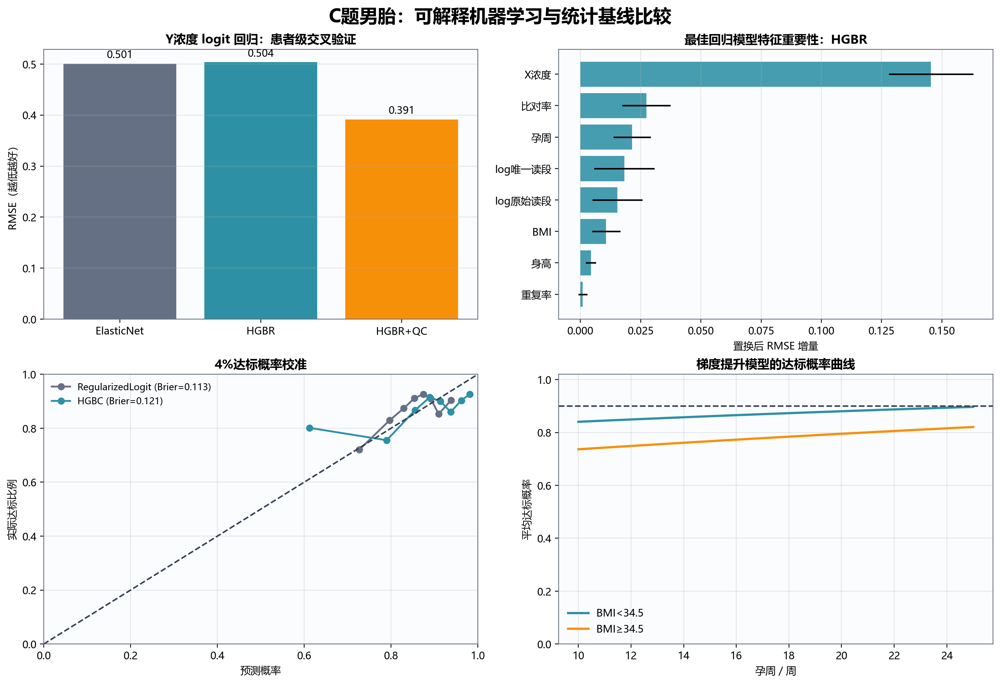
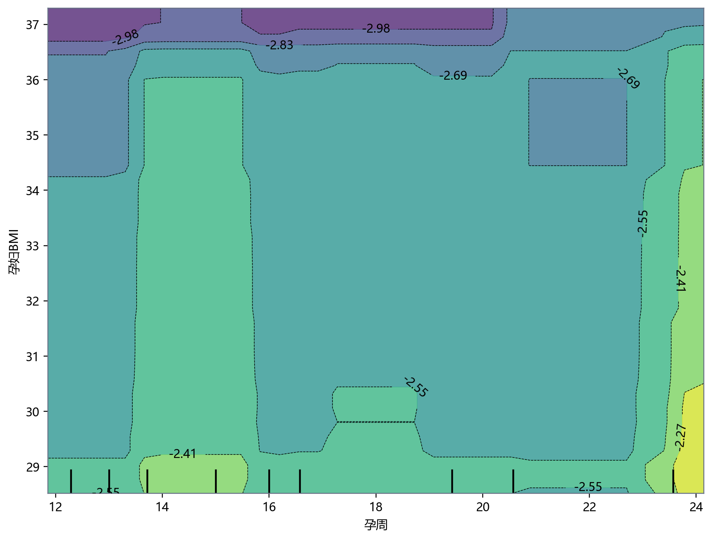
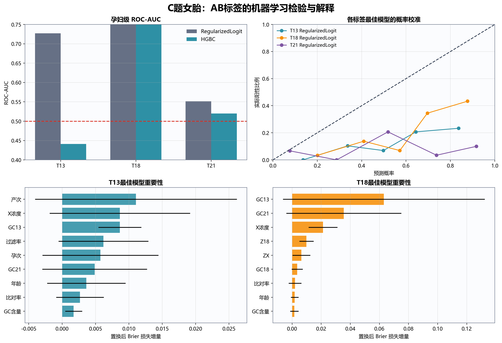
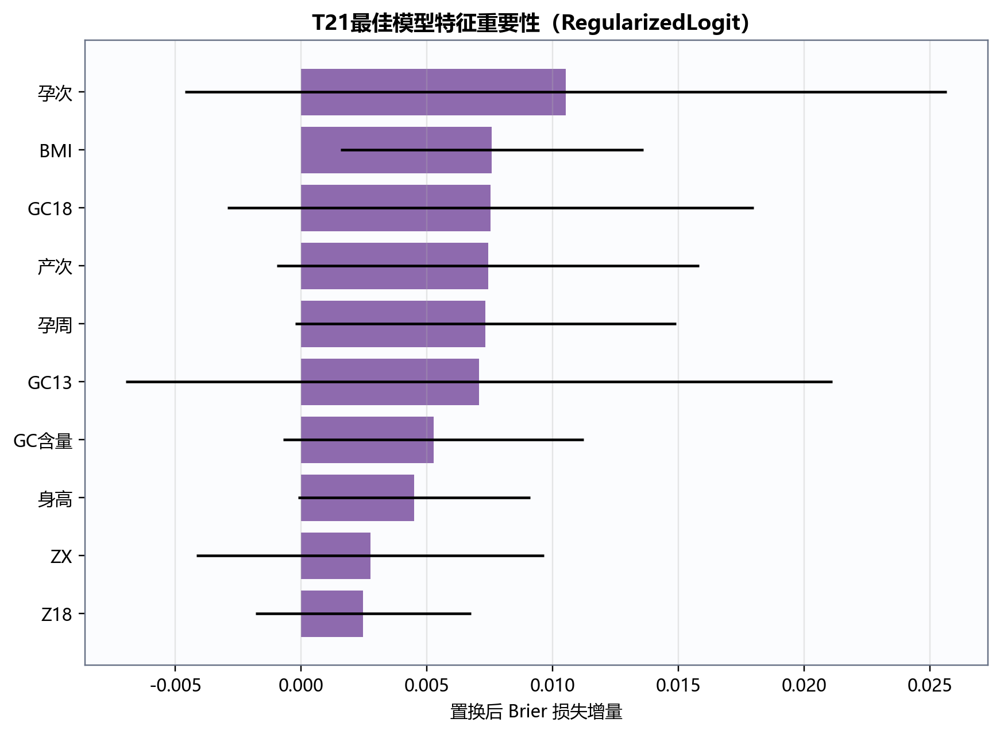

# C 题：NIPT 的时点选择与胎儿异常判定

## 1. 数据审计与建模单位

附件包含男胎 1082 条检测记录、267 名孕妇，女胎 605 条记录、147 名孕妇。平均每名孕妇约有 4 次检测，因此独立统计单位是“孕妇”，不是记录行。

所有交叉验证、bootstrap 和训练—验证划分必须按孕妇代码整体划分。若按行随机划分，同一孕妇的其他检测会同时出现在训练集与验证集，产生严重信息泄漏。

孕周统一转换为连续周数，例如

\[
11w+6=11+\frac67.
\]

男胎 BMI 范围约 20.70–46.88，均值 32.29，数据明显偏向高 BMI 人群，因此本文结论不外推至普通 BMI 总体。

## 2. 问题 1：Y 染色体浓度的关系模型

### 2.1 模型

Y 浓度位于 \((0,1)\)，先作 logit 变换：

\[
Y^*_{ij}=\log\frac{Y_{ij}}{1-Y_{ij}}.
\]

建立随机截距混合效应模型：

\[
Y^*_{ij}=\beta_0+\beta_1W_{ij}+\beta_2W_{ij}^2
+\beta_3B_i+\beta_4W_{ij}B_i+b_i+\varepsilon_{ij},
\]

其中 \(W\) 和 \(B\) 分别为标准化孕周、标准化 BMI，\(b_i\sim N(0,\sigma_b^2)\) 表示孕妇个体差异。

数据中孕周均值为 16.846 周、标准差 4.076 周；BMI 均值为 32.289、标准差 2.972。

### 2.2 估计结果

| 项 | 标准化系数 | p 值 | 结论 |
|---|---:|---:|---|
| 孕周 | 0.1668 | \(<10^{-40}\) | 显著正相关 |
| 孕周二次项 | 0.0428 | \(5.80\times10^{-6}\) | 存在轻微非线性 |
| BMI | -0.0719 | 0.00250 | 显著负相关 |
| 孕周×BMI | 0.00843 | 0.336 | 不显著 |

随机截距标准差为 0.434，测量残差标准差为 0.261。个体间差异大于同一孕妇的检测噪声，说明随机效应不可省略。

进一步加入年龄、身高、IVF、唯一比对读段数、比对率和 GC 含量后，AIC 从 836.33 降至 817.69；似然比检验

\[
\chi^2(6)=30.64,\qquad p=2.97\times10^{-5}.
\]

这些变量能解释部分浓度波动，但不等于它们都能稳定改善“最早达标时间”的预测，问题 3需要另外检验。

## 3. 问题 2：BMI 分组和最佳检测时点

### 3.1 区间删失

“第一次观测到 \(Y\ge4\%\)”不是精确的真实达标时间。真实时间 \(T_i\) 只知道位于最后一次未达标与第一次达标之间：

\[
T_i\in(L_i,U_i].
\]

267 名孕妇中：

- 第一次检测已经达标，即左删失：218 名；
- 先未达标后达标，即区间删失：42 名；
- 最后一次仍未达标，即右删失：7 名。

若直接把第一次达标孕周当成精确响应变量，会系统性高估真实达标时间并丢弃 7 个右删失样本。

采用 log-normal AFT 模型：

\[
\log T_i=\alpha_0+\alpha_1 BMI_i^*+\sigma\epsilon_i,
\qquad \epsilon_i\sim N(0,1).
\]

连续 BMI 模型中，标准化 BMI 的系数为 0.1192。因 BMI 标准差为 2.972，BMI 每增加 1，典型达标时间约乘以

\[
\exp(0.1192/2.972)=1.041,
\]

即延迟约 4.1%。

### 3.2 BMI 分组

在 2–4 个连续区间中搜索切点，并要求每组至少 35 名孕妇；以区间删失似然的 BIC 选择组数。最优结果为两组：

| 组 | 数据支持的 BMI 区间 | 人数 |
|---|---|---:|
| 1 | \([20.70,34.50)\) | 227 |
| 2 | \([34.50,46.88]\) | 40 |

切点约为

\[
\boxed{BMI=34.50}.
\]

第二组仅 40 人，因此不再细分。更多分组会产生不稳定的小样本区间。

### 3.3 检测时点

定义“最佳时点”为使组内至少 90% 孕妇的潜在 Y 浓度已达到 4%的最早孕周。该定义直接控制过早检测造成的不可靠概率，同时不引入无法由题目确定的主观医疗成本权重。

| BMI 组 | 90% 达标时点 | 换算结果 | 95% 达标时点 |
|---|---:|---|---:|
| \(<34.50\) | 14.315 周 | 约 14周+3天 | 17.439 周 |
| \(\ge34.50\) | 20.403 周 | 约 20周+3天 | 24.854 周 |

所以推荐

\[
\boxed{
t_1^*=14\text{周}+3\text{天},\qquad
t_2^*=20\text{周}+3\text{天}.
}
\]

由于 218 名孕妇在第一次观测时已经达标，模型对 10 周以前的分布依靠左删失外推。AFT 给出的组内中位时间低于 10 周，不应被当成可执行的检测时点；本文只在实际检测窗口内报告 90%和95%分位时点。

### 3.4 检测误差敏感性

以阈值从 4%上下移动 0.5 个百分点模拟浓度误差：

| 判定阈值 | BMI<34.50 的90%时点 | BMI≥34.50 的90%时点 |
|---:|---:|---:|
| 3.5% | 12.660 周 | 18.058 周 |
| 4.0% | 14.315 周 | 20.403 周 |
| 4.5% | 16.527 周 | 22.687 周 |

阈值误差会造成约 2–2.4 周的时点移动，是结论中最重要的不确定性来源。实际应用中不能只给单一孕周，必须同时报告测量误差情景。

## 4. 问题 3：多因素、达标比例与时点

在两组 BMI AFT 模型中加入年龄、身高和 IVF，并将它们固定在总体平均水平进行组间比较。没有同时自由加入体重、身高和 BMI，因为三者存在确定或近确定的共线关系。

多因素模型结果：

| BMI 组 | 多因素90%达标时点 | 向上取整到天 |
|---|---:|---|
| \(<34.50\) | 14.252 周 | 14周+2天 |
| \(\ge34.50\) | 20.002 周 | 20周+1天 |

但是：

\[
BIC_{\text{BMI组}}=429.60,\qquad
BIC_{\text{多因素}}=443.88.
\]

加入多因素后 BIC 变差且推荐时点只改变约 0.06–0.40 周。这说明这些因素能解释单次 Y 浓度的部分波动，却没有稳定改善区间删失达标时间模型。因此问题 3的最终建议不是强行采用复杂模型，而是：

\[
\boxed{仍采用问题2的两组BMI模型和14周+3天、20周+3天时点。}
\]

年龄、身高和 IVF 可用于个体风险提示，但当前 267 名孕妇不足以支持更细的多维分层。检测误差的影响也远大于加入这些协变量带来的时点调整。

## 5. 可解释机器学习扩展

为检验低维模型是否遗漏稳定的非线性规律，补充使用中等容量的直方图梯度提升树，并与正则化线性模型比较。所有外层验证均按孕妇代码分组；调参只在外层训练集内完成，重复检测不会跨越训练集与验证集。树模型最多使用 7 或 15 个叶节点、叶节点至少包含 25 或 45 条记录，并启用正则化和早停，避免以大参数量记忆小样本。

### 5.1 男胎 Y 浓度：生理规律与测序质量分开解释

以 Y 浓度的 logit 变换为目标，患者级嵌套交叉验证结果为：

| 模型 | 特征 | RMSE | MAE | \(R^2\) |
|---|---|---:|---:|---:|
| Elastic Net | 检测前生理变量 BIO | 0.501 | 0.405 | 0.023 |
| 梯度提升树 | 检测前生理变量 BIO | 0.504 | 0.404 | 0.011 |
| 梯度提升树 | BIO + 同次测序质控 QC | 0.391 | 0.305 | 0.403 |

BIO 包含孕周、BMI、年龄、身高、IVF、孕次和产次；QC 包含读段量、比对率、重复率、GC、过滤率和 X 染色体浓度。仅用 BIO 时，线性与非线性模型均只能解释约 1%–2% 的个体浓度差异，说明附件中的个体差异和测量波动远大于可由这些基本变量解释的部分。加入同次 QC 后，最重要的验证集置换特征依次为 X 浓度、比对率、孕周、唯一读段量、原始读段量和 BMI，说明附件中确有“测序质量状态”这一隐藏结构。

但 QC 和 X 浓度只有完成检测后才能获得，不能倒过来用于提前选择采血孕周；它们适合用于测后质控、异常浓度复核和解释批次波动。

### 5.2 男胎 4% 达标概率：不替代区间删失时点

只使用检测前 BIO 特征预测单条记录是否达到 4%：

| 模型 | ROC-AUC | 95% bootstrap CI | PR-AUC | Brier |
|---|---:|---:|---:|---:|
| L2 正则逻辑回归 | 0.604 | 0.506–0.684 | 0.893 | **0.113** |
| 梯度提升分类树 | 0.615 | 0.534–0.687 | 0.907 | 0.121 |

树模型的区分度仅略高，而概率校准更差；因此若要输出可解释概率，应保留正则逻辑回归。其平均预测到 25 周时，BMI<34.5 组达标概率约 0.897，BMI≥34.5 组约 0.821，均未达到预设 90%。这并不否定前述 AFT 结果，而是说明“记录级分类概率”和“首次达标时间的区间删失分布”不是同一估计对象，且 218 名孕妇首次观测即达标造成严重左删失。

因此时点主结论仍采用能正确处理左删失、区间删失和右删失的 AFT 模型，即 14 周 3 天和 20 周 3 天；机器学习只作为敏感性检查。

### 5.3 女胎 AB 输出：线性排序信号强于非线性模型

将 T13、T18、T21 的 AB 输出分别作为“需要复核”的代理标签，在孕妇层面汇总外层验证预测。特征包括生理变量、各染色体 Z 值与 GC、X 浓度和测序质控量。

| 标签 | 正则逻辑回归 AUC（95% CI） | 梯度提升树 AUC（95% CI） | 最佳模型 PR-AUC | 解释 |
|---|---:|---:|---:|---|
| T13 | **0.727**（0.590–0.837） | 0.441（0.301–0.593） | 0.274 | 有可复现的近线性排序信号 |
| T18 | **0.783**（0.689–0.871） | 0.750（0.639–0.851） | 0.557 | 线性模型仍更稳健 |
| T21 | **0.551**（0.382–0.740） | 0.520（0.316–0.717） | 0.191 | 无稳定信号，区间覆盖 0.5 |

T18 的主要验证集置换特征为 13/21 号染色体 GC、X 浓度、Z18 和 ZX，提示 AB 输出不只由目标染色体 Z 值决定，还混入了跨染色体 GC 与样本质量状态。T13 的重要性误差条较大，产次等变量更可能是队列代理而非因果因素，不能据此作医学解释。非线性树没有一致胜过正则线性模型，因此没有证据支持复杂高阶交互。

由于阳性类别稀少且使用类别权重，T13/T18 概率校准较差，只能作为排序和人工复核分数，不能解释为患病概率。

## 6. 问题 4：女胎异常判定

### 6.1 首先审计标签

女胎 AB 列共有 67 条异常记录，涉及 44 名孕妇：

- T13：23 条，18 名孕妇；
- T18：46 条，30 名孕妇；
- T21：13 条，12 名孕妇。

但女胎 AE“胎儿是否健康”605 条全部为“是”。因此附件没有经出生结局确认的真实异常阳性病例。AB 只能作为检测系统输出标签，不能作为真实胎儿异常金标准。

### 6.2 低维基线模型

分别对 T13、T18、T21建立低维 Firth 修正逻辑模型，避免稀有事件下的完全分离：

\[
\operatorname{logit}P(A_k=1)
=\alpha_k+\beta_{1k}Z_k+\beta_{2k}Z_X+\beta_{3k}Q_k,
\]

其中 \(Q_k\) 是由对应染色体 GC 偏移、过滤率和重复率组成的预先定义质控指标。模型只使用 3 个自由特征，没有进行高维变量筛选。

验证严格按孕妇代码进行 5 折分组交叉验证：

| 标签 | ROC-AUC | PR-AUC | 平衡准确率 | 灵敏度 | 特异度 |
|---|---:|---:|---:|---:|---:|
| T13 | 0.577 | 0.177 | 0.545 | 0.391 | 0.699 |
| T18 | 0.579 | 0.102 | 0.587 | 0.565 | 0.608 |
| T21 | 0.543 | 0.175 | 0.451 | 0.231 | 0.671 |

这一仅含 3 个特征的基线接近随机水平，说明单独使用目标 Z 值、ZX 和一个合成质控量不足。第 5 节进一步检验了较完整但仍受控的特征集：T13/T18 的 AB 输出可被正则线性模型一定程度排序，而 T21 仍无稳定信号；受控的 boosting 并未稳定胜过线性模型。

### 6.3 可交付的判定方法

当前附件只支持一个保守的三级流程：

1. **质控拒绝层**：GC 不在 40%–60%、有效读段不足、比对率异常或过滤率/重复率过高时，输出“结果不可靠，建议重新采血或测序”；不得强行输出正常/异常。
2. **染色体筛查层**：质控合格后，分别检查 13、18、21号染色体 Z 值；\(|Z_k|\ge3\) 仅作为需要复核的传统统计警戒线，而不是最终确诊。
3. **临床确认层**：警戒样本必须用独立检测或侵入性诊断确认。由于本附件女胎出生结局全为健康，无法从中估计真实灵敏度、特异度或阳性预测值。

因此，对问题 4最严格且数学上成立的结论是：

\[
\boxed{
附件不足以建立经真实结局验证的女胎异常判定器；
只能建立质控与复核规则。
}
\]

若论文必须给出分类结果，应将目标明确写为“复刻/复核 AB 检测输出”：完整特征正则模型的患者级 AUC 为 T13 0.727、T18 0.783、T21 0.551。前两者只表示对附件中 AB 输出有排序能力，不能包装为临床诊断准确率；T21 则连稳定排序能力也未得到支持。

## 7. 模型优点与局限

### 优点

- 混合效应模型正确处理同一孕妇的重复检测；
- 区间删失模型保留左删失、区间删失和右删失孕妇；
- BMI 切点有最小组样本量和 BIC 约束；
- 所有分类验证以孕妇为单位，避免信息泄漏；
- 机器学习采用嵌套分组验证、bootstrap 置信区间、早停和受限叶节点；
- 明确区分检测前特征与同次检测后质控特征，避免时间上的信息泄漏；
- 复杂模型只有在改善患者级验证或信息准则时才被保留。

### 局限

- 数据以高 BMI 孕妇为主，34.5 切点不能直接外推到其他地区；
- 218 名孕妇首次检测已达标，早期达标分布只能由左删失似然间接估计；
- 附件无法完全区分生物变化与同次采血重复测序误差；
- 女胎没有真实异常出生结局，问题 4存在根本性的标签不可辨识；
- 稀有阳性和类别加权导致 T13/T18 概率校准不佳，模型只宜排序复核；
- 90%达标规则是一种透明、可审计的风险准则，不等同于正式临床指南。
