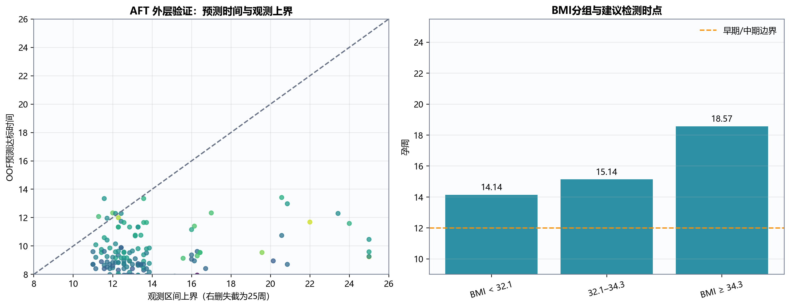
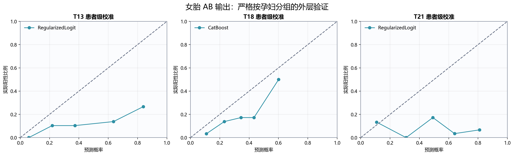

# C题：NIPT 时点选择与胎儿异常判定（v2：树模型重构）

> 本报告为新增版本，不覆盖 `C题解答.md`。旧版保留参数统计模型与低容量机器学习结果；本版重点报告区间删失提升树、扩大参数搜索、患者级外层验证和模型转向结论。

## 1. 数据与重构原则

附件包含男胎 1082 条检测记录、267 名孕妇，女胎 605 条检测记录、147 名孕妇。同一孕妇通常有多次检测，因此所有训练、调参和验证均按孕妇代码隔离，同一孕妇的记录不能同时出现在训练集和验证集。

男胎首次达到 Y 染色体浓度 4% 的时间不是普通回归标签。将同一孕妇、同一孕周的技术重复取 Y 浓度中位数后，可得到：

- 217 名孕妇首次观测时已经达标，记为左删失区间 $[0,u_i]$；
- 43 名孕妇在两次观测之间首次达标，记为区间删失 $[l_i,u_i]$；
- 7 名孕妇最后一次观测仍未达标，记为右删失区间 $[l_i,+\infty)$。

这意味着 81.3% 的男胎孕妇为左删失。模型可以估计群体时点，但对 10 周以前的个体达标顺序缺乏直接观测，不能把外推值当成可执行检测时间。最终建议严格限制在题目规定的 10–25 周窗口内。

## 2. 模型路线与搜索方法

### 2.1 问题 1：保留混合效应模型

问题 1 要求关系模型和显著性检验，因此保留旧版随机截距混合效应模型作为主模型：

$$
\operatorname{logit}(Y_{ij})=
\beta_0+\beta_1W_{ij}+\beta_2W_{ij}^2+
\beta_3B_i+\beta_4W_{ij}B_i+b_i+\varepsilon_{ij}.
$$

其中 $W$ 为标准化孕周，$B$ 为标准化 BMI，$b_i$ 为孕妇随机截距。主要结果如下：

| 变量 | 系数 | p 值 | 结论 |
|---|---:|---:|---|
| 孕周 | 0.1668 | $3.32\times10^{-48}$ | 显著正相关 |
| 孕周平方 | 0.0428 | $5.80\times10^{-6}$ | 存在显著非线性增长 |
| BMI | -0.0719 | 0.00250 | BMI 越高，Y 浓度越低 |
| 孕周×BMI | 0.00843 | 0.336 | 交互项不显著 |

加入年龄、身高、IVF 和测序质量变量后似然比检验显著（$p=2.97\times10^{-5}$），但随机截距标准差为 0.434，仍明显大于残差标准差 0.261，说明孕妇间未观测个体差异很强。树模型适合作为非线性补充，不替代问题 1 的显著性模型。

### 2.2 问题 2/3：XGBoost AFT 生存提升树

采用可直接处理左删失、区间删失和右删失的 XGBoost AFT：

$$
\log T_i=\mathcal{T}(x_i)+\sigma Z_i,
$$

其中 $\mathcal{T}$ 是提升树，输入仅包含检测前可获得的 BMI、年龄、身高、体重、IVF、孕次和产次。测序后的 Z 值和 QC 指标不进入时点模型，避免信息泄漏。

每个外层折内部执行 40 次 TPE 贝叶斯搜索，全样本最终模型执行 80 次搜索。搜索范围覆盖：

- 树深 2–8；
- 最小子节点权重 1–40；
- 学习率 0.008–0.16；
- 行、列采样率 0.55–1.00；
- L1、L2、分裂惩罚；
- normal、logistic、extreme 三种 AFT 分布；
- 最多 2500 轮并使用 80 轮早停。

最终模型使用 extreme 分布、树深 6、学习率 0.0222、最小子节点权重 27.83，共 361 轮。虽然允许较深树，搜索最终同时选择了较大的叶节点约束和分裂惩罚，说明数据更支持“较多弱树组成的正则化模型”，而不是少量无约束深树。

### 2.3 问题 4：按标签动态选择模型

女胎分别为 T13、T18、T21 建立一对其余分类器。候选模型为正则逻辑回归和 CatBoost；CatBoost 每个外层折内部执行 25 次 TPE 搜索。模型选择以患者级 OOF PR-AUC 为主，同时检查 ROC-AUC、Brier 损失和概率校准。

## 3. 问题 2：BMI 分组与最佳时点

### 3.1 外层验证

XGBoost AFT 的患者级嵌套验证结果为：

| 指标 | 结果 |
|---|---:|
| 外层 AFT 负对数似然 | 0.6894 ± 0.0215 |
| 区间可比较对一致性 | 0.5566 |
| 预测落入观测删失区间比例 | 79.40% |
| 到观测区间距离中位数 | 0 周 |

一致性 0.5566 只表示弱到中等的个体排序能力。原因是 217 名孕妇首次观测即达标，模型没有足够信息准确恢复这些孕妇在 10 周以前的先后顺序。因此本模型用于估计群体检测时点，不包装成高精度个体预测器。



### 3.2 分组搜索

先由每名孕妇的 OOF 达标概率曲线计算预测 90% 达标时点，再在 BMI 轴上搜索 2–4 个连续区间，要求每组至少 30 人，以组内时点离差的 BIC 选择组数。

不同组数的最优 BIC 为：

| 组数 | 最优 BIC |
|---:|---:|
| 2 | 362.002 |
| 3 | **358.184** |
| 4 | 363.077 |

为防止三组是单次随机分折造成的假象，固定最终参数后额外进行了 8 次不同随机种子的患者级四折验证。8/8 次均选择三组，其中 6/8 次精确得到 32.060、34.279 两个切点，其余两次只在相邻候选分位点上变化。因此采用三组方案：

| 组 | BMI 区间 | 人数 | OOF 平均 90% 达标时点 | 建议检测时点 |
|---:|---|---:|---:|---|
| 1 | BMI < 32.06 | 147 | 14.07 周 | **14周+1天** |
| 2 | 32.06 ≤ BMI < 34.28 | 66 | 15.14 周 | **15周+1天** |
| 3 | BMI ≥ 34.28 | 54 | 18.50 周 | **18周+4天** |

对应的 25 周平均达标概率分别为 0.993、0.989 和 0.970。三组时点均在 13–27 周的中期风险区，因此实际操作上不应无故晚于表中时点。

旧版参数 AFT 选择 BMI 34.50 的两组方案，建议约 14周+2天和 20周+3天。两种模型对“BMI 约 34.3–35 后需要明显推迟”这一结论一致；树模型进一步识别出 BMI 32.1–34.3 的过渡组，并且该过渡组在重复分折中稳定出现。

## 4. 问题 3：多因素与检测误差

最终 AFT 树的 gain 重要性从高到低主要为体重、孕次、产次、BMI、身高和年龄，IVF 在最终模型中未形成有效分裂。由于体重、身高和 BMI 存在确定性关系，gain 只说明模型把分裂放在何处，不能解释为因果效应大小。

多因素提升树并没有把患者级一致性提高到很高水平，说明年龄、身高、体重和孕产史只能提供有限的个体修正。最终仍采用稳定的 BMI 三组方案，而不是为每名孕妇输出看似精确、实则波动较大的个体日期。

将达标阈值从 4% 改为 3.5% 和 4.5%，得到误差敏感性结果：

| BMI 组 | 3.5% 阈值 | 4.0% 阈值 | 4.5% 阈值 | 极差 |
|---|---:|---:|---:|---:|
| BMI < 32.06 | 12周+3天 | 14周+1天 | 16周+2天 | 3.86 周 |
| 32.06–34.28 | 13周+4天 | 15周+2天 | 17周+6天 | 4.29 周 |
| BMI ≥ 34.28 | 16周+2天 | 18周+2天 | 21周 | 4.71 周 |

结果对阈值误差相当敏感，且高 BMI 组受影响最大。建议检测时采用以下原则：

1. 表中 4% 时点作为群体计划时点；
2. 高 BMI 或临界质量样本应保留复测窗口；
3. 若首次检测 Y 浓度接近 4%，不应仅凭一次测量判定可靠性；
4. 对 BMI ≥ 34.28 的孕妇，应重点控制测序质量并预留约 1–2 周复测时间。

## 5. 问题 4：女胎异常判定

### 5.1 患者级外层验证结果

| 标签 | 阳性孕妇 | 入选模型 | ROC-AUC（95% CI） | PR-AUC（95% CI） | Brier |
|---|---:|---|---:|---:|---:|
| T13 | 18 | 正则逻辑回归 | 0.745（0.627–0.846） | 0.287（0.162–0.509） | 0.230 |
| T18 | 30 | CatBoost | 0.741（0.635–0.846） | 0.505（0.336–0.672） | 0.162 |
| T21 | 12 | 无稳定模型 | 0.444（0.258–0.649）* | 0.158（0.043–0.359）* | 0.298* |

`*` 为 T21 正则逻辑回归结果；CatBoost 的 ROC-AUC 为 0.515、PR-AUC 为 0.092，仍没有稳定判别价值。



完整搜索改变了 pilot 阶段的部分选择：T13 的 CatBoost PR-AUC 最终降至 0.258，因此回退到正则逻辑回归；T18 的 CatBoost 同时改善 PR-AUC、ROC-AUC 和 Brier，因此保留；T21 两类模型均不可靠，不继续通过加深树追分。

### 5.2 判定流程

建议采用“分标签建模 + 不确定性复核”流程：

1. 对所有记录完成缺失值处理，使用孕周、BMI、年龄、身高、体重、孕产史、四条染色体 Z 值、各染色体 GC、读段数与比例、过滤率及 X 浓度；
2. T13 使用正则逻辑回归患者级概率；在 OOF 数据上，为达到至少 90% 灵敏度，对应阈值约 0.253，灵敏度 1.000、特异度 0.395；
3. T18 使用四个外层 CatBoost 模型的概率平均；阈值约 0.199 时，灵敏度 0.900、特异度 0.282；
4. T21 不输出自动阳性结论，将其标记为“模型证据不足，需按原始 Z 值、实验室规则和复测结果复核”；
5. 任一模型阳性只能解释为“复核附件 AB 检测输出”，不能解释为真实胎儿异常诊断。

阈值对应的特异度较低，表明这套模型更适合作为高召回预筛工具，而不是独立诊断器。附件中“胎儿是否健康”列不能提供足够的异常临床结局验证，因此本题无法从附件估计真实诊断灵敏度和特异度。

## 6. 结论

本次重构的最终结论为：

1. 孕周与 Y 浓度显著正相关，BMI 与 Y 浓度显著负相关；孕妇间未观测差异很强；
2. 对首次达到 4% 的时间，应使用区间删失模型而不是记录级二分类；
3. BMI 三组方案在 8 次重复患者级验证中稳定，推荐时点为 **14周+1天、15周+1天、18周+4天**；
4. 阈值误差可使建议时点移动约 3.9–4.7 周，高 BMI 组必须预留复测窗口；
5. 女胎 T13 采用正则逻辑回归，T18 采用 CatBoost，T21 不支持自动判定；
6. 大参数搜索的价值在于验证搜索空间，而不是必然选择更深的树。最终保留的模型均具有明显正则化，且在无稳定增益时主动回退。

## 7. 可复现文件

- 主程序：`analysis/c_tree_solution.py`
- 完整结果：`outputs/C题/传统机器学习重构/tree_results.json`
- BMI 分组：`outputs/C题/传统机器学习重构/BMI分组与时点.csv`
- 分组稳定性：`outputs/C题/传统机器学习重构/BMI分组稳定性.csv`
- 误差分析：`outputs/C题/传统机器学习重构/检测误差敏感性.csv`
- 女胎 OOF 概率：`outputs/C题/传统机器学习重构/女胎OOF预测.csv`
- AFT 最终模型：`outputs/C题/传统机器学习重构/xgboost_aft_model.json`
- T18 CatBoost 交叉拟合模型：`outputs/C题/传统机器学习重构/T18_catboost_fold1.cbm` 至 `fold4.cbm`

完整重跑命令：

```powershell
$env:PYTHONUTF8='1'
& 'E:\anaconda\envs\yolov_env\python.exe' 'analysis\c_tree_solution.py' --mode full
```

